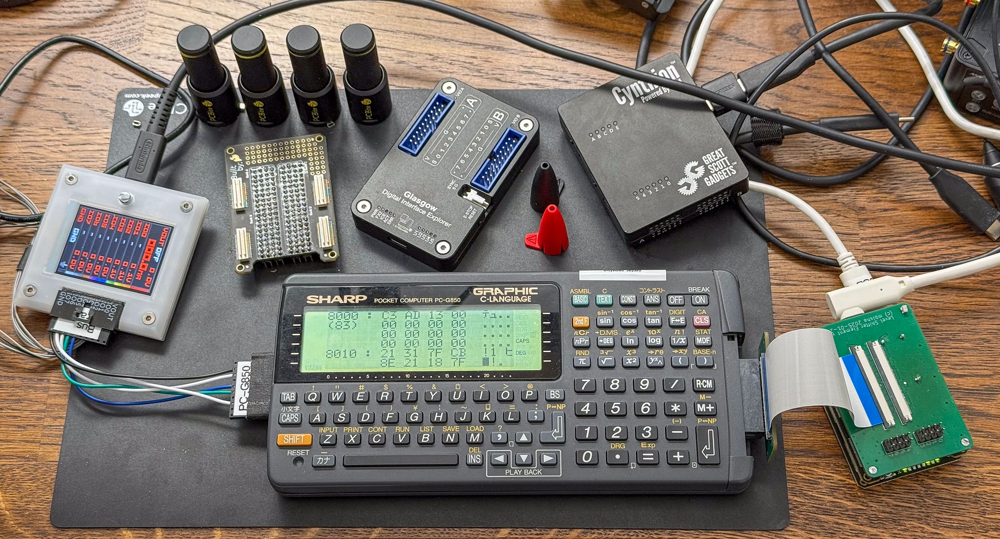

# RetroBus Explorer

RetroBus Explorer is an FPGA-based platform designed to capture, analyze, and
visualize signals from legacy 5V system buses. It uses a specialized
level-shifting interface board for bus compatibility, streams the captured data
through an FT600 FTDI chip, and presents live waveforms, decoded protocols, and
analytics via a Marimo Notebook interface in the browser.

# Current Status

* SHARP PC-G850 (Z80-based)

    **Bus Decoding**: Works

    **Visualization**:

     * SED1560 LCD controller: Basic functionality works
     * Key Matrix: Works (decodes key scanning with IO ports)

    **ROM Decoding**: In Progress ([Binary Ninja
    Plugin](https://github.com/mblsha/Z80/blob/master/SharpPCG850View.py))

    **External ROM Emulation**: Can stream data in ext banks 0 and 1 from USB3
    continuously, this could be used for video playback

# Hardware

Project is built on top of [Alchitry Au FPGA board](https://www.sparkfun.com/alchitry-au-fpga-development-board-xilinx-artix-7.html) and [Ft Element board](https://www.sparkfun.com/alchitry-ft-element-board.html).
To interface with the 5V bus, a Level Shifter Element board is used.

Hardware adapters connect the Level Shifter Element board to the target system.
Up to 48 signals can be captured simultaneously.

Up to two adapters can be connected at the same time, allowing to capture
communication on the system bus and the external bus card.

# Hardware Adapters

* Pin Tester to test correctness and signal integrity
* SHARP PC-G850
* SHARP PC-E500

# License

* PCB Design Files
All PCB design files are distributed under the
`CERN Open Hardware Licence Version 2 – Permissive`.

* Software (HDL, JS, etc.)
Other than the d3xx Python code all other repository contents—including FPGA
gateware (HDL), and Python code are released under the `Apache License 2.0`.

You are free to use, modify, and distribute both portions of this project under
their respective terms.

# Alternatives

* [LAIR](https://github.com/MustBeArt/LAIR) project shows how to decode Z80
    bus using a hardware adapter with propagation delays that connects to a
    136-channel HP Agilent 1670G logic analyzer.

# USB Device Info

* Alchitry Au

  Product ID: 0x6010
  Vendor ID:  0x0403  (Future Technology Devices International Limited)

* Alchitry Ft

  Name: FTDI SuperSpeed-FIFO Bridge
  Product ID: 0x601e
  Vendor ID:  0x0403  (Future Technology Devices International Limited)

# Thanks

A big thank you (in alphabetical order) to Louis, Nikolai, and
[Peter](https://taricorp.net) for teaching me the dark magic of hardware and
low-level development, as well as for patiently answering my countless
questions. This project would not exist without your help.
